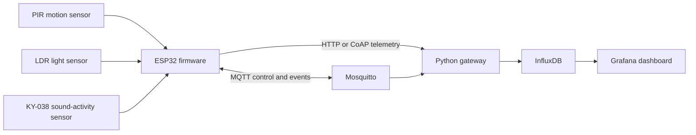

# LibraryDeskSense

LibraryDeskSense is an ESP32-based IoT system for monitoring the environmental
conditions and occupancy of a single library desk. It combines local sensing,
switchable HTTP/CoAP telemetry, MQTT-based runtime control, InfluxDB storage,
and a provisioned Grafana dashboard.

The system detects activity without identifying users or recording audio.

## What it demonstrates

- ESP-IDF firmware written in C with multiple FreeRTOS tasks
- PIR-based occupancy detection
- Analog light-level sampling with the ESP32 ADC
- Sound-activity detection by counting digital sensor edges
- HTTP and CoAP telemetry with runtime protocol switching
- MQTT configuration, status, event, and communication-metric topics
- A Python gateway for HTTP, CoAP, MQTT, and InfluxDB
- Rolling utilization analytics and simple one-step trend forecasting
- Grafana dashboard and data-source provisioning
- Measurement of latency, payload size, protocol overhead, delivery success,
  and communication efficiency

## System architecture



## Hardware

- ESP32 development board (original Xtensa-based ESP32 target)
- PIR motion sensor connected to GPIO 18
- KY-038 digital sound sensor connected to GPIO 32
- LDR voltage-divider output connected to ADC1 channel 6
- USB cable and a 2.4 GHz Wi-Fi network

Pin assignments and thresholds can be changed in
`components/application_code/application_code.c`.

## Repository structure

```text
.
|-- components/application_code/   ESP-IDF firmware
|-- grafana/                       dashboard and provisioning files
|-- library_desksense.py           local Python gateway and analytics
|-- mosquitto.conf                 local MQTT broker configuration
|-- requirements.txt               Python dependencies
|-- sdkconfig.defaults             reproducible ESP32 defaults
`-- .env.example                   backend configuration template
```

ESP-IDF downloads `espressif/coap` from the component registry during the
build. Generated `managed_components/` content is intentionally not committed.

## Prerequisites

- ESP-IDF 5.x
- Python 3.10 or newer
- Mosquitto
- InfluxDB 2.x
- Grafana

## Configuration

### 1. Configure the firmware

Copy the example header and edit the local values:

```powershell
Copy-Item `
  components/application_code/project_config.example.h `
  components/application_code/project_config.h
```

Set the 2.4 GHz Wi-Fi credentials and the LAN IPv4 address of the computer
running the backend. The resulting `project_config.h` file is ignored by Git.

### 2. Configure the backend

Install the Python dependencies:

```powershell
python -m venv .venv
.\.venv\Scripts\Activate.ps1
python -m pip install -r requirements.txt
```

Create an InfluxDB bucket and token, then set the required variables in the
shell that will run the gateway:

```powershell
$env:INFLUX_URL = "http://127.0.0.1:8086"
$env:INFLUX_ORG = "your-organization"
$env:INFLUX_BUCKET = "library-desksense"
$env:INFLUX_TOKEN = "your-local-token"
$env:MQTT_BROKER = "127.0.0.1"
```

Do not commit real tokens or Wi-Fi credentials.

## Build and flash

From an ESP-IDF terminal:

```powershell
idf.py set-target esp32
idf.py build
idf.py -p COM5 flash monitor
```

Replace `COM5` with the port used by the board.

## Run the local services

Start InfluxDB, Mosquitto, and Grafana using their normal installation
commands. Then start the gateway:

```powershell
mosquitto -c mosquitto.conf -v
python library_desksense.py
```

On Windows, after setting the required InfluxDB environment variables, you can
also run `START.bat`. The launcher starts services it can find locally and
opens the Grafana dashboard. It does not terminate existing processes or
contain machine-specific paths, network addresses, ports, or credentials.

The gateway listens on:

- HTTP: TCP port `18080`
- CoAP: UDP port `5683`
- MQTT: TCP port `1883`

Grafana provisioning files are located under `grafana/provisioning/`. The
dashboard is available in `grafana/dashboards/library_desksense.json`.

## Runtime control

Publish values to these MQTT topics:

| Topic suffix | Purpose |
|---|---|
| `communication_mode` | Switch between `http` and `coap` |
| `sampling_rate` | Set telemetry interval in seconds |
| `occupancy_timeout` | Set inactivity timeout in seconds |
| `light_threshold` | Set the low-light ADC threshold |
| `noise_threshold` | Set the sound-edge threshold |

All topics use the prefix `library/desk1/config/`. The ESP32 publishes
acknowledgements to `library/desk1/config/ack`.

## Privacy

The project does not record audio or identify individuals. The KY-038 is used
only as a digital activity detector, and the firmware counts signal edges
during each sampling window.

## Limitations and next steps

- The current firmware targets the original ESP32, not an ESP32-C3/C6.
- MQTT is configured for a trusted local network and permits anonymous access.
- Protocol-overhead values are estimates at the application and transport
  layers rather than packet-capture measurements.
- Future work could add TLS/DTLS, authenticated MQTT, multi-desk support,
  calibration tools, automated tests, and an ESP32-C6 RISC-V port.

## Author

Mani Khavarinejad

## License

This project is released under the MIT License.
